  

 

  

    🌸 <b>COMPUTER SCIENCE STUDENT</b> × <b>ASPIRING FULL-STACK DEVELOPER</b> 🔮
  

  

    Building clean, responsive web projects and connecting intuitive interfaces with functional backend logic. I'm currently in the process of becoming a full-stack developer, expanding my toolkit and learning by building one project at a time.
  

 

  <!-- Pastel Pink and Lavender GitHub Stats -->
  
  

 

### ✨ Current Focus
*   **Building:** Small, clean web applications, focusing on responsive one-page sites and interactive features.
*   **Learning:** Deepening my understanding of `Express.js`, `Supabase`, and full-stack integration.

### 🛠️ The Toolbox

  <!-- Core Languages -->
  &nbsp;&nbsp;
  &nbsp;&nbsp;
  &nbsp;&nbsp;
  <!-- Web & Design -->
  &nbsp;&nbsp;
  &nbsp;&nbsp;
  &nbsp;&nbsp;
  <!-- Backend & Tools -->
  &nbsp;&nbsp;
  

 

<!-- THE SNAKE WILL GO HERE -->

  <picture>
    <source media="(prefers-color-scheme: dark)" srcset="https://raw.githubusercontent.com/lantoallen/lantoallen/output/github-contribution-grid-snake-dark.svg">
    <source media="(prefers-color-scheme: light)" srcset="https://raw.githubusercontent.com/lantoallen/lantoallen/output/github-contribution-grid-snake.svg">
    
  </picture>

